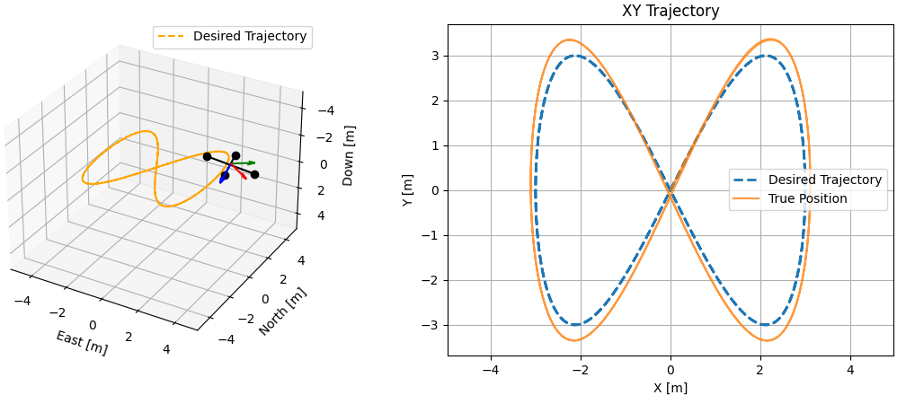

# quadrotor-sim-py

A minimal quadrotor flight simulator written in Python, designed for academic research and fast prototyping.

## Features

1. **Lightweight quadrotor simulator**  
   Models quadrotor dynamics down to the force and torque level. Ideal for fast prototyping and algorithm testing.

2. **Rigidbody dynamics with SE(3) model**  
   Dynamics modeled on the SE(3) Lie group with Runge-Kutta 4th-order integration (RK4).  
   Includes a default implementation of the nonlinear [Geometric Tracking Controller](https://ieeexplore.ieee.org/document/5717652).

3. **Python-based and easily extendable**  
   Designed for integration with tools like [CasADi](https://web.casadi.org/) or [PyTorch](https://pytorch.org/) for advanced control or learning-based development.

4. **Flight trajectory visualization**  
   Animated 3D visualization of quadrotor motion alongside the desired trajectory.

## Run the simulator

Before running the simulator, install the required packages:

```bash
pip install -r requirements.txt
```

Then run the simulation:

```bash
python ./main.py
```

## Project Structure

```
quadrotor-sim-py/
├── main.py                 # Entry point of the simulation
├── requirements.txt        # Required Python packages
├── trajectory_planner.py   # Trajectory planner
├── dynamics.py             # Quadrotor dynamic model
├── geometric_control.py    # Geometric tracking controller for quadrotor
├── se3_math.py             # SE(3) math utilities
├── rigidbody_visualize.py  # 3D visualization
├── utils/                  # Placeholder
│       └── __init__.py
├── preview.png             # Preview image of the simulator
```

## Preview



## License

This project is licensed under the **MIT License**.  
Feel free to use, modify, and distribute without restriction.
